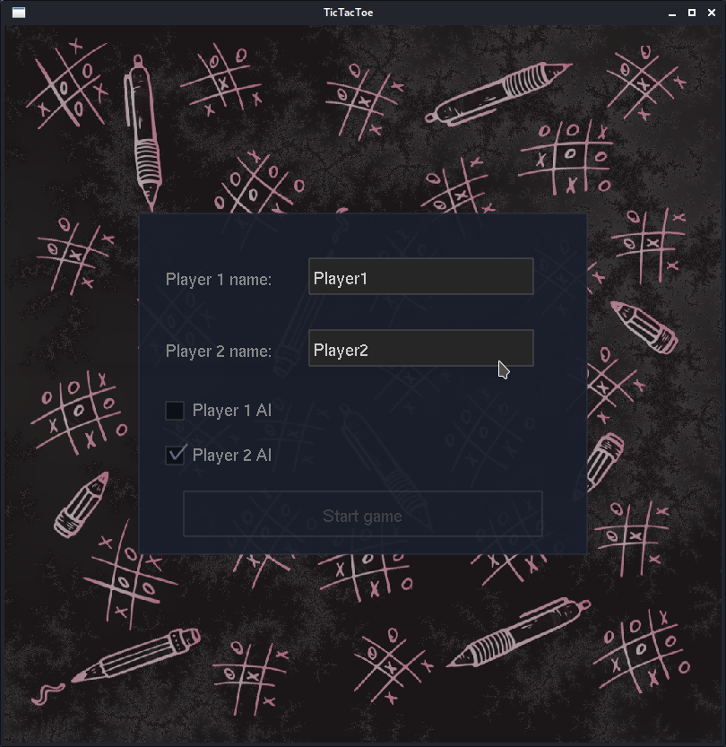

# TicTacToe

The classic game TicTacToe written in C. The game uses my simple S3D engine for its running. The game offers several game modes: player vs player, player vs AI and AI vs AI. It is not possible to use another AI from an external binary file in the application, the application uses only its internal AI.

OS: Linux, Debian
OpenGL 4.6, GLUT

